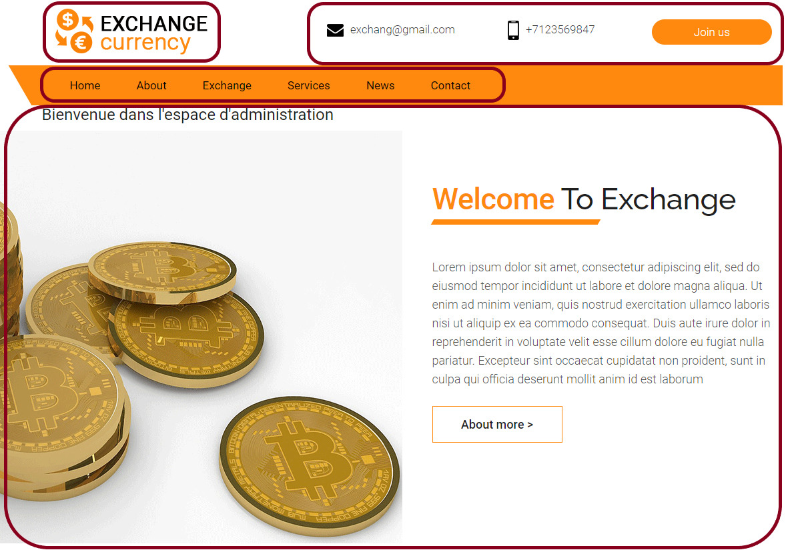
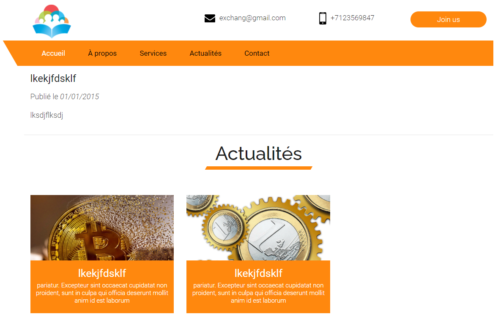

# Exercice 2

## Administration des actualités

Dans l'état le site ne comporte pas d'espace public et privé.

### Espace Admin (sans connexion utilisateur)

#### Création de la page /admin
Nous allons créer un espace admin **sans connexion utilisateur**.
 
Pour initialiser l'espace admin, nous allons créer un Controller **AdminController**. 

* Lancer la commande `php bin/console make:controller`
* Indiquez comme nom de classe `AdminController`

La commande va vous générer deux fichiers : 
```
 created: src/Controller/AdminController.php
 created: templates/admin/index.html.twig
```

> Vous pouvez accéder à la page `/admin` de votre projet pour constater le résultat.
>
> N'hésitez pas à modifier le contenu de la page, par exemple : 
> ```html
> <div>
>      <h1>Bienvenue dans l'espace d'administration</h1>
>  </div>
> ```
> Supprimez la balise `<style>` qui ne sert pas.


#### Création du template d'administration

Vous remarquerez que la page d'administration est intégrée au design global du site.

L'idée est désormais de créer un espace d'administration avec un design différent que l'espace public.

Pour cela nous allons créer deux fichier `twig`
* `admin/layout.html.twig`
* `public/layout.html.twig`

Avant de créer ces fichiers, identifions les différents "blocks" TWIG à créer. Ces blocks sont destinés à être surchargés dans les pages d'administration.


* Block "logo"
* Block "header_links"
* Block "navbar_links"
* Block "layout" : La particularité de ce block est qu'il servira d'intermédiaire entre le template principal `base.html.twig` et les templates enfants (`index.html.twig`/`new.html.twig`/`edit.html.twig`, etc...)

Modifions d'abord le fichier `templates/base.html.twig` :

> Pensez à faire une copie du fichier pour ne pas perdre les éléments graphiques existants.

```html
        <div class="container">
            <div class="row">
                <div class="logo_section">
                    
                        <a class="navbar-brand" href="{{ path('index')}}"></a>
                    
                </div>

                
                    <div class="site_information">
                        <ul>
                            <li><a href="mailto:exchang@gmail.com">exchang@gmail.com</a></li>
                            <li><a href="tel:exchang@gmail.com">+7123569847</a></li>
                            <li><a class="join_bt" href="#">Join us</a></li>
                        </ul>
                    </div>
                

        <!-- -->
            <div class="collapse navbar-collapse justify-content-end" id="navbar-wd">
                <ul class="navbar-nav">

                    
                        <li><a class="nav-link active" href="{{ path('index')}}">Home</a></li>
                        <li><a class="nav-link" href="about.html">About</a></li>
                        <li><a class="nav-link" href="exchange.html">Exchange</a></li>
                        <li><a class="nav-link" href="services.html">Services</a></li>
                        <li><a class="nav-link" href="{{ path('article_index')}}">News</a></li>
                        <li><a class="nav-link" href="{{ path('contact')}}">Contact</a></li>
                    

        <!-- -->

    <body id="home" data-spy="scroll" data-target="#navbar-wd" data-offset="98">
    
        
    
        
            {{ encore_entry_script_tags('app') }}
        
    </body>
</html>
```

Créons ensuite le fichier `admin/layout.html.twig` :

```html


Hello AdminController!


    <a class="navbar-brand" href="{{ path('admin')}}">
        
    </a>



    <div class="site_information">
        <ul>
            <li><a class="join_bt" href="{{ path('test_entity_index') }}">Voir le site</a></li>
        </ul>
    </div>



    <li><a class="nav-link active" href="{{ path('article_index')}}">Actualités</a></li>




    <!-- Start header -->
    <div class="section first">
        <div class="container">
            <div class="row">
                <div class="col-md-12">
                    
                </div>
            </div>
        </div>
    </div>


```

Remplacer dans `admin/index.html.twig`  la ligne `` par `` 

> Vous pouvez constater que la page `/admin` a bien changé d'apparence. 

Maintenant, modifier les pages suivantes pour qu'elles héritent du template `admin/layout.html.twig` :
* `article/new.html.twig`
* `article/edit.html.twig`

> Indication : Seuls les blocks `title` et `body` ont besoin d'être surchargés

Pour plus d'informations sur l'utilisation des blocks, vous pouvez vous référer à la [documentation twig](https://twig.symfony.com/doc/3.x/tags/extends.html) à ce sujet. 

#### Création du template public

En reprenant l'exemple du template d'administration, créez le template public `templates/public/layout.html.twig`.

```html


Welcome!



    <div class="section first">
        <div class="container">
            <div class="row">
                <div class="col-md-12">
                    
                </div>
            </div>
        </div>
    </div>

    <!-- Reste des éléments graphiques -->


```

Modifiez ensuite les templates suivants pour qu'ils soient adaptés au layout public :
* `article/show.html.twig`
* `article/index.html.twig`
* `contact/index.html.twig`

#### Modification de la liste des articles

Maintenant que nous avons deux designs différents pour les espaces administration et public, nous allons pouvoir implémenter les éléments graphiques existants.

L'idée ici est de reprendre le morceau de HTML suivant, pour afficher les articles :
 
```html

  <div class="section layout_padding padding_top_0">
        <div class="container">
            <div class="row">
                <div class="col-md-12">
                    <div class="full">
                        <div class="heading_main text_align_center">
                            <h2><span class="theme_color"></span>Actualités</h2>
                        </div>
                    </div>
                </div>
            </div>
            <div class="row">
                
                        <div class="col-md-4 col-sm-6 col-xs-12">
                            <div class="full news_blog">
                                
                                <div class="overlay">><a class="main_bt transparent" href="{{ path('article_show', { 'id' : article.id }) }}">Voir</a></div>
                                <div class="blog_details">
                                    <h3>{{ article.title }}</h3>
                                    <p>pariatur. Excepteur sint occaecat cupidatat non proident, sunt in culpa qui officia deserunt mollit anim id est laborum</p>
                                </div>
                            </div>
                        </div>
                
            </div>
        </div>
    </div>

``` 

#### Modification de la page d'un article

L'objectif est de designer la page d'un article, de manière à afficher l'article en lui même (titre / sous titre / contenu), mais également les autres articles existants.

Vous êtes libre de la disposition graphiques de la page, même si elle devrait être assez simple, basique.
En dessous de l'article, vous pouvez disposer la liste des autres articles.

Pour cela, il faut injecter tous les articles dans la page d'un article seul : 
```php
    public function show(Article $article, ArticleRepository $articleRepository): Response
    {
        return $this->render('article/show.html.twig', [
            'article' => $article,
            'articles' => $articleRepository->findAll(),
        ]);
    }
```

Vous pouvez ensuite reprendre votre travail de la partie "Modification de la liste des articles" pour afficher les autres articles.
> Astuce : 
> Pour ne pas afficher l'article en cours dans la section des autres articles, ajoutez une condition dans la boucle : 
```twig
    
        
            <div class="col-md-4 col-sm-6 col-xs-12">
                {# ... #}
            </div>
        
    
```

Le résultat peut ressembler à ça : 


