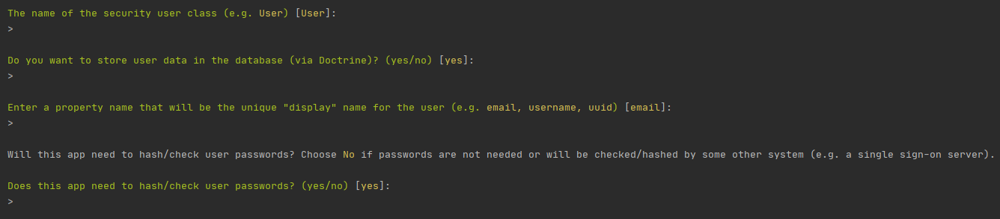

# Authentification

Le cahier des charges impose une interface d'administration, accessible via un formulaire de connexion.

Les fonctionnalités liées à cela sont donc : 
* Interface de connexion
* Lien de déconnexion
* Formulaire d'inscription

## Installation de la librairie de sécurité

Lancer la commande `composer require security` pour installer les librairies symfony utiles pour mettre en place l'authentification.

## Création de l'entité _User_

Pour mettre en place l'authentification, nous aurons besoin d'une entité _User_, pour sauvegarder en base de données les identifiants de connexion (`email` / `password`).

Lancer la commande `php bin/console make:user`.
La commande va vous demander plusieurs informations : 
* Le nom de la classe représentant un utilisateur. Gardez la valeur par défaut `User`
* Est-ce que l'utilisateur doit être stocké en base de donnée. **Évidemment oui**
* Entrez un nom de propriété qui sera le nom «d'affichage» unique de l'utilisateur. Gardez la valeur par défaut `email`.
* Est-ce que l'application a besoin de hasher/vérifier les mots de passe. **Évidemment oui** 



Les fichiers suivants vont être créés : 
* `src/Entity/User.php` : Entité représentant les utilisateurs
* `src/Repository/UserRepository.php` : Repository permettant de trouver un utilisateur
* `config/packages/security.yaml` : Fichier de configuration de la sécurité (authentification / Déconnexion / Sécurité des routes)

> N'oubliez pas de lancer les commandes de mise à jour de la BDD 
> * `php bin/console make:migration`
> * `php bin/console doctrine:migrations:migrate`

### Créer le formulaire de connexion

Lancer la commande `php bin/console make:auth` 

Suivre les instruction suivantes pour le déroulement de la commande : 

* _What style of authentication do you want?_  : Saisissez l'option `1`
* _The class name of the authenticator to create_ : Saisissez `LoginAuthenticator` 
> Remarque : Vous pouvez saisir n'importe quel nom de classe, tant qu'il respecte les conditions de nommage d'une classe.
* _Choose a name for the controller class_ : Vous pouvez garder la valeur par défaut `SecurityController`
* _Do you want to generate a '/logout' URL ?_ : Saisissez `yes`

Lorque la commande se termine, les fichiers suivants seront créés : 
* `src/Security/LoginAuthenticator.php`
* `src/Controller/SecurityController.php`
* `templates/security/login.html.twig`

Et le fichier `config/packages/security.yaml` sera mis à jour.

La commande vous indique qu'une modification est nécessaire dans le fichier `LoginAuthenticator`.
En effet, lorsque l'utilisateur se connecte, il faut faire une redirection vers une page.

Recherchez la ligne :  
```php
    throw new \Exception('TODO: provide a valid redirect inside '.__FILE__);
```
Remplacez là par une redirection interne au site. Dans l'exemple, la route `admin_index` existe, donc **vérifiez bien que la route que vous saisissez existe.**
```php
    return new RedirectResponse($this->urlGenerator->generate('admin_index'));
```

### Créer le formulaire d'inscription

Lancer la commande `php bin/console make:registration-form`

Les fichiers suivants seront créés : 
* `src/Controller/RegistrationController.php`
* `src/Form/RegistrationFormType.php`
* `registration/register.html.twig`

### Modification des templates

Pour accéder aux formulaires d'inscription et de connexion, il vous faudra modifier les templates TWIG générés, pour qu'ils héritent du template `public/layout.html.twig`.

Sans quoi, vous ne verrez rien sur les pages `/login` et `/register`.

#### Debugger la connexion

Installer le profiler Symfony : `composer require --dev symfony/profiler-pack`

Le profiler vous permet de vérifier :
* Sur quelle route vous vous trouvez
* Si vous êtes connecté, et avec quel compte
* Le code déprécié
* Les messages de traduction manquants

### Inscription / Connexion / Déconnexion

Rendez-vous sur la page `/register` pour vous créer un compte.

Si vous n'avez pas configuré l'inscription pour vous connecter automatiquement, rendez-vous sur la page `/login` pour vous connecter.

Si vous avez bien installé le profiler Symfony, vous pouvez voir dans la barre d'outils en bas de votre site que vous êtes bien connecté.

Si la connexion s'est bien passée, vous pouvez vous déconnecter en accédant à l'url `/logout`.


### Liens d'inscription / connexion / déconnexion 

Maintenance que l'authentification est en place, il faut des liens pour accéder aux nouvelles pages.

Modifions le fichier `base.html.twig` pour remplacer le lien "Join us" pour qu'il serve à se connecter ou se déconnecter.

```twig
<li><a href="tel:exchang@gmail.com">+7123569847</a></li>
<li>
    
        .... lien de déconnexion ...
    
        ... lien de connexion ...
    
</li>
``` 

> `app` est une variable globale fournit par le framework, qui permet d'accéder a des informations globales du site, telles que :
> * `app.user` : l'utilisateur courant, qui vaut `null` si l'utilisateur n'est pas authentifié
> * `app.request` : La requête courante

Vous pouvez retrouver plus d'information à ce sujet via la [documentation Symfony](https://symfony.com/doc/4.0/templating/app_variable.html)

Il ne vous reste plus qu'à ajouter un lien pour s'inscrire.
Ce lien doit être ajouté de préférence sur la page de connexion.

```twig
<div class="alert alert-info my-3">
    <p>Vous n'avez pas de compte ? <a href="{{ path('app_register') }}">Inscrivez-vous !</a> </p>
</div>
```

#### Sécurisation de l'espace administration

Actuellement, la page d'administration est accessible à tout le monde, en accédant à `/admin`.

Mais maintenant que nous pouvons nous authentifier, il faut sécuriser toutes les urls qui commencent par `/admin`.

Modifier le fichier `config/packages/security.yaml` en décommentant les lignes : 
```yaml
access_control:
    - { path: ^/admin, roles: ROLE_USER }
```

Vérifiez qu'en étant déconnecté, vous ne pouvez pas accéder aux pages qui commencent par `/admin`.
