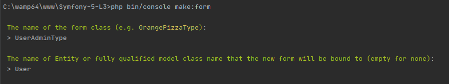
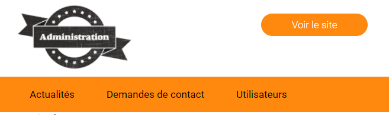
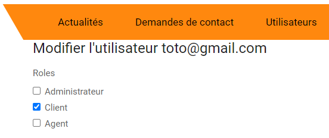
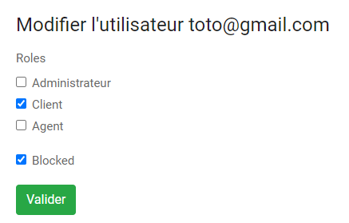

#### NOTE IMPORTANTE : 

* **Contrairement aux TPs du lot 1 (TPs 1 à 5), les TPs du lot 2 vous pousseront à beaucoup plus d'autonomie et de réflexion personnelle.**

* Ces TPs ne contiendront donc pas les commandes Symfony déjà utilisées, car vous pouvez les retrouver dans les précédents TP ou **via des recherches Google**
* Seules les nouvelles connaissances seront détaillées. 
* Le lot 2 a pour but **d'évaluer votre capacité à implémenter par vous-mêmes les fonctionnalités** du cahier des charges
* Les TPs contiendront tout de mêmes des indices des solutions possibles, mais sans vous donner la réponse. 

___ 
# Lot 2 - Administration des utilisateurs

> Rappel du cahier des charges :
>
> **Gestion des utilisateurs**
> * L'administrateur peut consulter/éditer/bloquer/débloquer des comptes utilisateurs.


Ce TP consiste à ajouter à l'espace d'administration les fonctionnalités standards de la gestion des comptes utilisateurs.

## Liste des utilisateurs

* Pour intégrer à l'espace d'administration la liste des utilisateurs, **créer un CRUD de l'entité User sera très pratique.**
> Ne pas oublier de : 
> * modifier les templates créés pour qu'ils s'intègrent à l'espace d'administration
> * adapter les routes, pour qu'elle soient préfixées par `/admin`

* Reprendre les fonctions `index` et `edit` du `UserController` pour les intégrer au `AdminController`. 

* **Attention, l'administrateur ne peut pas créer un utilisateur**, seul le formulaire d'inscription permet de créer un utilisateur.
* L'administrateur ne doit pouvoir modifier que le rôle des utilisateurs, et bloquer/débloquer leur compte

> Le mieux est donc de créer un nouveau formulaire pour l'entité `User`. 

> La commande `php bin/console make:form` vous permet de créer un formulaire à partir d'une entité (voir la capture ci-dessous).



L'administrateur doit avoir accès à la liste des utilisateurs via sa barre de navigation.


    
___

### Sécurité et rôle des utilisateurs

Le cahier des charges permet d'identifier 3 rôles :
 
* `ROLE_ADMIN` : Administrateur
* `ROLE_AGENT` : Agent de la société
* `ROLE_USER` : Utilisateur ayant créé un compte

Vous pouvez utiliser le type de champ [ChoiceType](https://symfony.com/doc/current/reference/forms/types/choice.html) pour modifier la propriété `roles` de l'entité `User`.

> On peut envisager qu'un utilisateur ait plusieurs rôles, mais ce n'est pas une obligation.
>
> L'entité `User` a déjà une propriété `roles`, qui est un tableau, donc **ne créez pas une entité `Role`.** ou une nouvelle propriété.
> 

Vous aurez besoin d'ajouter les attributs `expanded` et `multiple` aux options du champ "roles" : 
```
    ->add('roles', ChoiceType::class, [
            'choices'  => [
                // À compléter
            ],
            'expanded' => true,
            'multiple' => true
```


___
### Bloquer un utilisateur

Pour vérifier qu'un compte utilisateur soit bloqué ou non, il faut ajouter une nouvelle propriété à l'entité `User` (par exemple `blocked`).

Cette propriété doit être de type `boolean`.

> Vous pouvez utiliser le type de champ [CheckboxType](https://symfony.com/doc/current/reference/forms/types/checkbox.html)

> Dès que le champ est en place, cochez-le pour un des utilisateurs inscrits sur votre site.



#### Modifier la création d'un utilisateur

Étant donné que nous venons d'ajouter un nouvelle propriété à l'entité `User`, qui doit valoir par défaut `false`, nous devons modifier la création de l'utilisateur.

Pour cela, il faut modifier la fonction native `__construct` de l'entité `User` : 

```php
class User implements UserInterface
{
    // propriétés 
    
    public function __construct(){
        $this->blocked = false;
    }
    
    // getters & setters
```   
> Si vous avez ajouter un autre nom que `blocked` comme propriété, adaptez l'exemple ci-dessus.

#### Vérifier si un utilisateur est bloqué

Dans le TP 5, vous avez mis en place les fonctionnalités d'inscription, de connexion et de déconnexion.

Nous voulons donc pouvoir interdire à un utilisateur de se connecter si son compte est bloqué. 

Pour cela il faut modifier le fichier `src/Security/LoginAuthenticator`. (_Chez vous ce n'est peut être pas exactement le même nom de classe_)

```php
public function getUser($credentials, UserProviderInterface $userProvider){

    //...

    // "$user->getBlocked()" retourne true ou false
    // Donc la condition "if ($user->getBlocked())" veut dire "si l'utilisateur est bloqué"

    if ($user->getBlocked()){
        throw new CustomUserMessageAuthenticationException('Ce compte utilisateur est bloqué.');
    }

    return $user;
}
```

